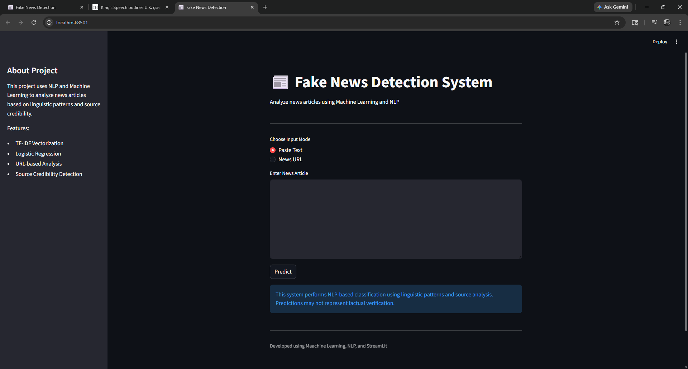
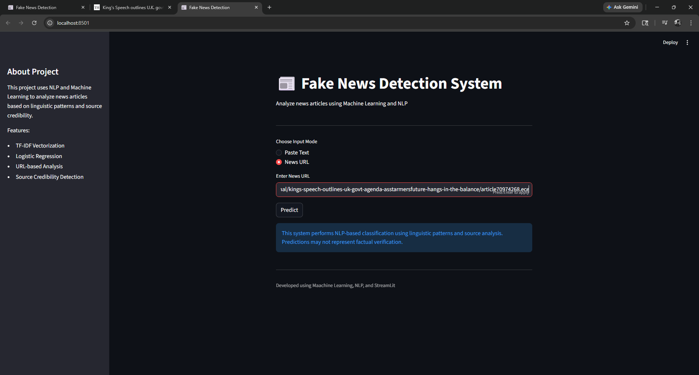
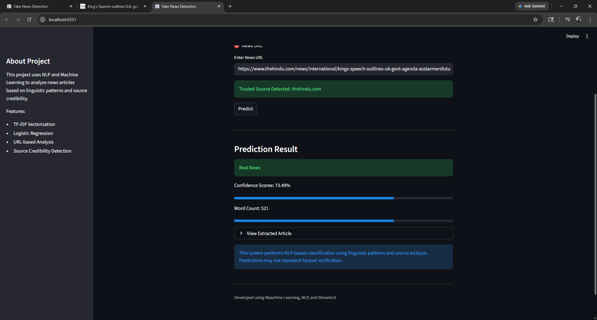
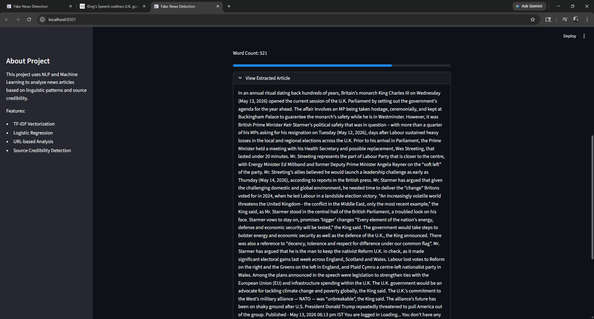

# 📰 AI-Powered News Credibility Analysis System

An NLP and Machine Learning based web application that analyzes news articles and predicts whether the content appears **Real** or **Fake** based on linguistic patterns and source credibility analysis.

This project supports:
- ✍ Manual text analysis
- 🌐 Real-time URL-based article extraction
- 📊 Confidence score prediction
- ✅ Trusted source detection

Built using **Python**, **Scikit-learn**, **Streamlit**, and **Natural Language Processing (NLP)**.

---

# 🚀 Features

- 📰 Fake vs Real news classification
- 🌐 URL-based news article extraction
- ✍ Manual news text input
- 📊 Confidence score visualization
- ✅ Trusted news source detection
- ⚡ Real-time prediction system
- 🎨 Clean dark-themed Streamlit UI
- 📄 Expandable extracted article viewer
- 🧠 NLP-based preprocessing pipeline

---

# 🛠️ Technologies Used

| Technology | Purpose |
|---|---|
| Python | Core Programming Language |
| Streamlit | Frontend Web Application |
| Scikit-learn | Machine Learning |
| TF-IDF Vectorizer | Text Feature Extraction |
| Logistic Regression | Classification Model |
| Pandas | Data Processing |
| NumPy | Numerical Operations |
| Trafilatura | News Article Extraction |
| NLP | Text Preprocessing |

---

# ⚙️ System Workflow

```text
User Input (Text or URL)
            ↓
News Article Extraction
            ↓
Text Preprocessing
            ↓
TF-IDF Vectorization
            ↓
Logistic Regression Model
            ↓
Prediction + Confidence Score
            ↓
Source Credibility Analysis
```

---

# 🧠 Machine Learning Model

This project uses:

    -TF-IDF Vectorizer
    -Logistic Regression Classifier

The model is trained on fake and real news datasets using Natural Language Processing techniques.

---

# 🔍 How It Works
##📝 Text Input Mode

User pastes news article text
System preprocesses the text
TF-IDF converts text into numerical vectors
Logistic Regression predicts:
✅ Real News
🚨 Fake News
🌐 URL Input Mode

User enters a news article URL
System extracts article content automatically
Source credibility is checked
NLP pipeline analyzes article text
Prediction and confidence score are displayed

---
# 📊 Features Included

✅ Confidence Score
✅ Progress Bar Visualization
✅ URL-based Article Analysis
✅ Trusted Source Detection
✅ Expandable Extracted Article Viewer
✅ Error Handling for Invalid URLs
✅ NLP-based Text Cleaning

---
# 🛡️ Disclaimer

This system performs NLP-based classification using linguistic patterns and source credibility analysis.

Predictions may not represent factual verification and should not be treated as absolute truth.
---

# 📦 Installation

1️⃣ Clone the Repository
```bash
git clone https://github.com/your-username/fake-news-detection.git
```
2️⃣ Navigate to Project Directory
```bash
cd fake-news-detection
```
3️⃣ Install Dependencies
```bash
pip install -r requirements.txt
```
4️⃣ Run the Application
```bash
python -m streamlit run app.py
```

---

# 📈 Model Performance

The model was trained using NLP preprocessing and TF-IDF feature extraction.

Current Capabilities
Fast text classification
Linguistic pattern detection
Real-time URL extraction
Basic source credibility analysis
📸 Application Preview
🔹 Home Interface
Text & URL Input
Source Detection
Prediction System
🔹 Prediction Output
Fake/Real Classification
Confidence Score
Article Viewer

---
# 📸 Application Screenshots

## Home Interface


## URL Analysis


## Prediction Result


## Extracted Article

---

# 🌍 Future Improvements

🤖 BERT / Transformer-based NLP models
🌐 Real-time fact verification APIs
🧩 Browser extension support
🌎 Multilingual news analysis
📱 Mobile-friendly deployment
🧠 Advanced semantic analysis
🚀 Deployment

This project can be deployed using:
Streamlit Cloud
Render
Hugging Face Spaces

---

# 👨‍💻 Author

Durgesh Kumar Rout
---

# 📜 License

This project is open-source and available for educational and learning purposes.
